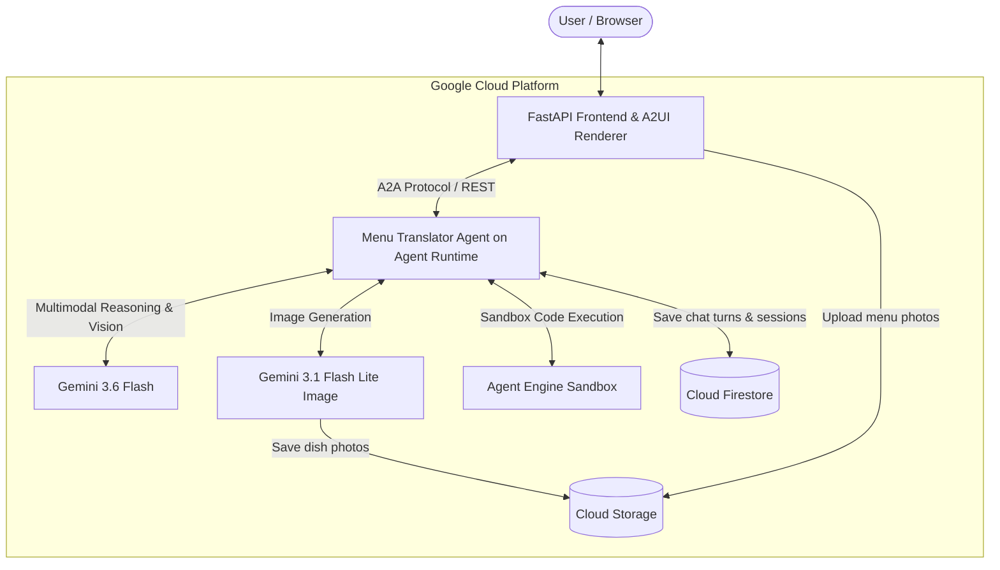

# 🍽️ Menu Translator — Multimodal Travel Dining Agent

[](https://antigravity.google)
[](#)
[](https://cloud.google.com/products/agent-platform)
[](https://google.github.io/adk-docs/)
[](https://ai.google.dev/)
[](https://adk.dev/integrations/a2ui/)

> A conversational, multimodal agent that helps travelers effortlessly read, understand, and visualize foreign restaurant menus, identify dietary details (vegetarian, vegan, non-vegetarian), and preview authentic dish photos generated on the fly.

---

## 🌟 Overview

When traveling abroad or visiting authentic international restaurants, reading the menu can be daunting. Foreign scripts, unfamiliar dish names, and vague ingredient descriptions leave travelers uncertain about what they are ordering—especially diners with strict dietary restrictions.

**Menu Translator** solves this by combining multimodal vision, structured reasoning, generative imagery, and agent-first UI:
1. **Snap & Upload**: The user uploads a photo of any restaurant menu.
2. **Intelligent Extraction & Categorization**: Powered by **Gemini 3.6 Flash**, the agent translates and explains each dish while categorizing them into `[Non-Vegetarian]`, `[Vegetarian]`, and `[Vegan]`.
3. **Rich Agent-First UI (A2UI)**: Instead of unformatted walls of text, results are presented as structured, clean A2UI cards and categorized rows.
4. **On-Demand Dish Visuals**: When a user inquires about a specific dish, the agent generates high-resolution, photorealistic plate previews with **Gemini 3.1 Flash Lite Image** and serves them via **Google Cloud Storage**.
5. **Session & History Persistence**: All interactions, session contexts, user uploads, and generated visuals are stored in **Cloud Firestore** and **Cloud Storage**.

---

## 🏗️ Architecture



### Component Breakdown

| Layer | Technology | Role |
|---|---|---|
| **Agent Reasoning** | [Google ADK](https://google.github.io/adk-docs/) + [`agents-cli`](https://google.github.io/agents-cli/) | Core agent loop handling multimodal queries and tool dispatch |
| **Foundation Model** | `gemini-3.6-flash` | Multimodal OCR, translation, dish description, and dietary categorization |
| **Image Generation** | `gemini-3.1-flash-lite-image` | Synthesizes realistic dish photos on demand |
| **Agent-to-UI** | [A2UI](https://adk.dev/integrations/a2ui/) (v0.8 Catalog) | Generates structured UI components (Cards, Columns, Rows, Images) |
| **Storage & Persistence** | Cloud Storage & Firestore | Stores uploaded menu photos, generated dish images, and chat history |
| **Code Sandbox** | Agent Engine Sandbox | Isolated environment for safe code execution |
| **Frontend Web App** | FastAPI + Static HTML/JS | A2A client proxy with built-in A2UI card renderer and photo upload |

---

## 📁 Repository Structure

```
.
├── menu-translator/               # Main Agent Application
│   ├── app/                       # Agent implementation
│   │   ├── agent.py               # ADK Root Agent, system prompt & A2UI schema
│   │   ├── tools.py               # GCS upload, Firestore logging, image gen tool
│   │   ├── a2ui_utils.py          # A2UI callback transformer for adk web
│   │   └── fast_api_app.py        # Local FastAPI backend
│   ├── frontend/                  # Web Frontend & A2A Proxy
│   │   ├── main.py                # FastAPI proxy connecting to Agent Runtime via A2A
│   │   └── static/                # Interactive Chat UI & A2UI Renderer
│   ├── agents-cli-manifest.yaml   # Deployment & agent configuration
│   ├── deployment_metadata.json   # Deployed Agent Runtime & Sandbox IDs
│   └── pyproject.toml             # Python dependencies
├── project_brief.md               # Initial project design and architecture brief
└── README.md                      # Project documentation
```

---

## 🛠️ Key Tools & Features

### 1. `get_dish_image(dish_name: str)`
- Checks for an authenticated Google Custom Search image if configured.
- Fallback: Uses `gemini-3.1-flash-lite-image` on Vertex AI to generate an authentic plate presentation.
- Uploads the image to a Google Cloud Storage bucket (`dish_images/`) and returns a public HTTPS link for A2UI rendering.

### 2. Firestore Chat Persistence
- **`chat_history` collection**: Logs full conversation turns, including user inputs, uploaded GCS image URLs, agent replies, and generated images.
- **`chat_sessions` collection**: Maintains indexed session metadata and structured message arrays.

### 3. Agent Engine Sandbox
- Configured with `AgentEngineSandboxCodeExecutor` to allow the agent to run code securely in a managed sandbox environment.

---

## 🚀 Getting Started

### Prerequisites

- **Python 3.11+**
- [uv](https://docs.astral.sh/uv/) (Python package manager)
- [Google Cloud SDK](https://cloud.google.com/sdk/docs/install) (`gcloud`)
- [agents-cli](https://google.github.io/agents-cli/guide/getting-started/):
  ```bash
  uv tool install google-agents-cli
  ```

### Authentication & Setup

```bash
# 1. Authenticate with Google Cloud
gcloud auth login
gcloud auth application-default login

# 2. Set your Google Cloud project
gcloud config set project <YOUR_PROJECT_ID>

# 3. Navigate to the agent directory and install dependencies
cd menu-translator
agents-cli install
```

### Running Locally with ADK Web Playground

To test the agent reasoning loop and A2UI cards locally:

```bash
cd menu-translator
agents-cli playground
```

Open `http://localhost:8000` to interact with the agent in the ADK web interface.

### Running the Web Frontend

To launch the web interface with photo upload and A2UI support:

```bash
cd menu-translator/frontend
pip install -r requirements.txt
uvicorn main:app --host 0.0.0.0 --port 8080 --reload
```

Open `http://localhost:8080` in your browser.

---

## 🚢 Deployment

### Deploying the Agent to Agent Runtime

The agent can be deployed directly to Google Cloud Agent Platform:

```bash
cd menu-translator
agents-cli deploy
```

This creates a managed reasoning engine instance with A2A protocol support, code sandbox, and Cloud Trace telemetry.

---

## 📄 License

This project was developed as part of the **Build with Gemini** World Tour (Track 3: Agent-First Applications). Distributed under the Apache 2.0 License.
